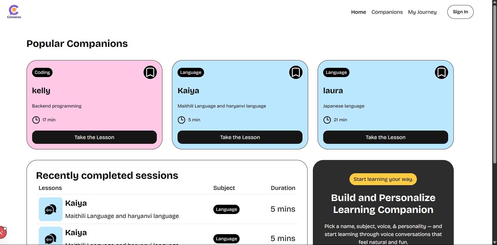
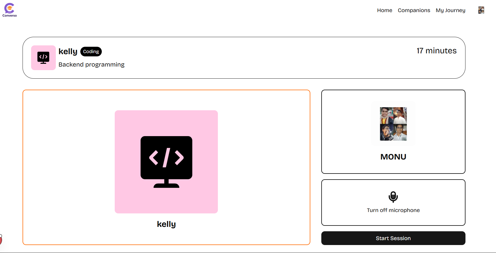

<p align="center">
   
  
</p>

<h1 align="center">🚀 Converso</h1>
<p align="center">
  <b>AI-powered companion platform</b><br>
  
  
  
  
  
</p>

<p align="center">
  <a href="#-features">✨ Features</a> •
  <a href="#-quickstart">⚡ Quickstart</a> •
  <a href="#-screenshots">🖼️ Screenshots</a> •
  <a href="#-contributing">🤝 Contributing</a> •
  <a href="#-license">📝 License</a>
</p>

---

## ✨ Features

<p align="center">
  
  
  
  
  
</p>

- ⚡ **Modern App Router** (Next.js)
- 🔒 **Clerk Authentication**
- 🟢 **Supabase Database**
- 🧩 **Server Actions** (no extra endpoints)
- 🎨 **Modern UI** (React + Tailwind CSS)

---

## ⚡ Quickstart

```bash
git clone https://github.com/your-username/mentora.git
cd mentora
npm install
```

1. **Configure `.env.local`:**

   ```env
   NEXT_PUBLIC_CLERK_PUBLISHABLE_KEY=your_clerk_publishable_key
   CLERK_SECRET_KEY=your_clerk_secret_key
   NEXT_PUBLIC_SUPABASE_URL=your_supabase_url
   NEXT_PUBLIC_SUPABASE_ANON_KEY=your_supabase_anon_key
   ```

2. **Run the app:**
   ```bash
   npm run dev
   ```

---

## 🖼️ Screenshots

<p align="center">
  
  
</p>

---

## 🤝 Contributing

Contributions, issues and feature requests are welcome!  
Feel free to check [issues page](../../issues) or submit a pull request.

---

## 📝 License

MIT License © [code-place7](https://github.com/code-place7)

---

<p align="center">
  <sub>Built with ❤️ using Next.js, Clerk, and Supabase</sub>
</p>
